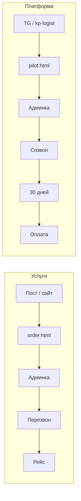

# Воронка для одного человека — АРМАДА

**Для кого:** вы один, времени мало.  
**Не про:** сложную CRM, рекламу на миллионы, «лид-scoring».

**Про что:** от **первого касания** до **денег или пилота** — кто что делает, где это уже есть в app.armada.sx, что добавить без программирования.

---

## Два разных продукта = две воронки

Не одна «воронка Армада». Иначе снова путаете «манипулятор» и «кабинет логиста».

```
ВОРОНКА A — УСЛУГИ (машина на объект)
  увидел → заявка → перезвон → рейс → повтор

ВОРОНКА B — ПЛАТФОРМА (SaaS)
  увидел → интерес → заявка пилот → созвон → 30 дней → оплата
```

Контент и посты **ведут в одну из двух** — см. [PLAN_DLYA_VLADELCA.md](./PLAN_DLYA_VLADELCA.md).

---

## Воронка A — заявка на транспорт

### Схема (5 шагов)

| Шаг | Что происходит | Где у вас | Ваша задача (solo) |
|-----|----------------|-----------|---------------------|
| **1. Увидел** | Пост VK/TG, armada.sx, сарафан | armada.sx, соцсети | 2 поста/нед → ссылка на order |
| **2. Кликнул** | Открыл форму | `app.armada.sx/order.html?vtype=…&source=…` | Кнопки на WP по ARMADA_SX_ORDER_LINKS |
| **3. Оставил заявку** | Форма отправлена | Лид в **админке** «Заявки armada.sx» | — |
| **4. Перезвон** | Уточнили, назначили машину | Телефон, WhatsApp | **SLA: тот же рабочий день** — это 80% воронки |
| **5. Рейс + повтор** | Выполнили, запомнили | Excel/голова/CRM не нужна на старте | «Сохранить в контакты», через месяц напоминание |

### Где «дыра» чаще всего

- Нет перезвона вовремя → человек звонит конкуренту.  
- На сайте нет кнопки online → звонят только «горячие», остальные теряются.

### Минимальная автоматизация (без кода)

| Что | Как |
|-----|-----|
| Понять, откуда пришёл | В ссылках уже есть `source=armada.sx` / `telegram` — допишите в постах |
| Не забыть перезвонить | Будильник / заметка «заявки» 2 раза в день; или Telegram-бот «напоминалка» себе |
| После заявки клиенту | Текст в SMS или WhatsApp-шаблон: «Приняли, перезвоним до …» — **вручную**, 1 шаблон |

### Улучшения «когда будет время» (можно в коде позже)

- Страница «Спасибо, заявка №…» (LANDING_PLAN L4.3).  
- SMS «заявка принята» автоматом.  
- Яндекс.Метрика на order.html — видеть, сколько открыли форму и сколько отправили.

---

## Воронка B — пилот кабинета (логист / перевозчик)

### Схема (6 шагов)

| Шаг | Что происходит | Где у вас | Ваша задача |
|-----|----------------|-----------|-------------|
| **1. Увидел** | Пост про кабинет, ЭТрН, скрин | TG, реже VK | [CONTENT_AUTOMATION_SOLO.md](./CONTENT_AUTOMATION_SOLO.md) |
| **2. Прочитал** | Понял «не ATI, пилот 30 дней» | kp-logist.html, pilot.html | Тексты на лендинге (L1) |
| **3. Заявка** | Имя, телефон, роль | pilot.html → админка «Пилот» | Ответ в течение **48 ч** (реалистично для solo) |
| **4. Созвон 15–20 мин** | Боль, сколько машин, подходит ли | Zoom/телефон | Чеклист вопросов ниже |
| **5. Пилот 30 дней** | Включили кабинет, обучили | Продукт | 1 инструкция + ссылка help |
| **6. Оплата / отказ** | Тариф или «не сейчас» | billing / договор | Не тянуть: день 25–28 пилота — звонок |

### Чеклист созвона (сохраните в заметки)

1. Сколько машин? Кто диспетчер — вы сами?  
2. Как сейчас: звонки, Excel, ATI?  
3. Нужен ли **портал заказчику**?  
4. ЭТрН — уже обязательно или «потом»?  
5. Готовы 2–3 вечера на ввод данных?  
6. Если да → дата старта пилота, одна точка контакта.

### Где «дыра»

- Заявка пилота без созвона → человек остыл.  
- Пилот без вашего сопровождения → «не понял, бросил».

### Минимальная автоматизация

| Что | Как |
|-----|-----|
| Черновик ответа на заявку | Cursor + FACTS: «письмо: заявка пилота получена, созвон …» |
| После созвона | Одно сообщение со ссылками `/a/` или инструкция PDF |
| День 7 и 21 пилота | 2 напоминания себе в календаре «позвонить пилоту X» |

---

## Одна картинка на холодильник



---

## Соцсети — не «воронка», а **верхушка**

Посты **не закрывают** сделку. Они только кормят шаг **«увидел»**.

| Контур | CTA в посте | Воронка |
|--------|-------------|---------|
| [Услуги] | order.html | A |
| [Платформа] | pilot.html или kp-logist | B |

Раз в неделю Cursor — см. шаблон промпта. Воронка ломается **ниже** — на перезвоне и созвоне.

---

## Что считать «работает» (без MBA)

Заведите **одну** таблицу в Google Sheets / блокнот на месяц:

**Воронка A**

| Неделя | Заявки order | Перезвон ≤24ч | Рейсов |
|--------|--------------|---------------|--------|

**Воронка B**

| Неделя | Заявки pilot | Созвоны | Активных пилотов |

Если **A: заявки есть, рейсов мало** → проблема перезвона/цены, не Instagram.  
Если **B: заявки есть, пилотов нет** → созвон или продукт на вводе.

---

## Приоритет для вас сейчас

1. **Закрыть шаг 4 воронки A** — перезвон в тот же день (даже 10 мин между доставками).  
2. **Один TG-канал** → только CTA на order **или** pilot, по очереди недель.  
3. **Не** строить email-цепочки на 7 писем, пока в таблице не будет 4 недель цифр.

---

## Если попросите разработку (отдельные задачи)

| Фича | Зачем воронке |
|------|----------------|
| Metrika + цели «отправка формы» | Видеть обрыв шаг 2→3 |
| `landing-thanks.html` | Успокоить после шага 3 |
| Авто-SMS «заявка принята» | Меньше тревоги клиента |
| Поле utm в лиде | Откуда пришёл pilot |

Это **после** того, как перезвоны и созвоны уже привычка.

---

*Связано: [PLAN_DLYA_VLADELCA.md](./PLAN_DLYA_VLADELCA.md) · [CONTENT_AUTOMATION_SOLO.md](./CONTENT_AUTOMATION_SOLO.md)*
