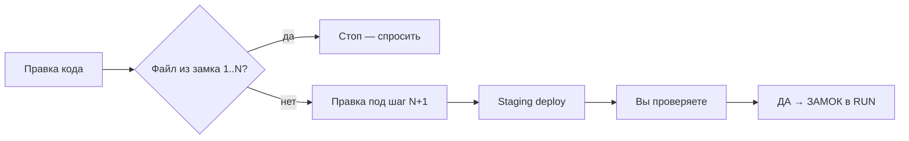

# Изоляция шагов прогона QA (сценарий 1)

**Зачем:** при правке шага **N+1** не ломать уже **проверенные** шаги **1…N**.

**Связано:** [ORDER_LIFECYCLE_QA_PLAN.md](ORDER_LIFECYCLE_QA_PLAN.md) · [ORDER_LIFECYCLE_QA_RUN.md](ORDER_LIFECYCLE_QA_RUN.md) · [ORDER_LIFECYCLE_QA_AGENT.md](ORDER_LIFECYCLE_QA_AGENT.md) (подшаги 1a/1b и файлы)

**Preflight (read-only):** `BASE_URL=https://staging.app.armada.sx ./scripts/preflight-order-lifecycle-qa.sh`

---

## Перед любой правкой кода (агент)

1. Открыть **таблицу шагов** и блок **«ЗАМКИ»** в [ORDER_LIFECYCLE_QA_RUN.md](ORDER_LIFECYCLE_QA_RUN.md) — на каком шаге **последний установленный ЗАМОК** (N)?
2. Смотреть **карту файлов** ниже: правка попадает в файлы шагов **≤ N**?
   - **Да** → стоп: только с вашей фразой **«да, чини шаг N»** (или «сломался шаг N»).
   - **Нет** → можно править под шаг **N+1** (или текущий ⏳ без замка).
3. Один PR/коммит = **один QA-STEP**; не смешивать, например, order.html (шаг 1) и назначение (шаг 3).
4. Деплой проверки — **staging**, пока вы не сказали «ок на prod».



---

## Правило ЗАМОК (gate)

| Событие | Что фиксируем |
|---------|----------------|
| Вы написали **«проверил / ок / ДА»** на шаг **N** | **На шаге N установлен ЗАМОК** — запись в блок **ЗАМКИ** в `ORDER_LIFECYCLE_QA_RUN.md` |
| В журнале | `APP_BUILD` staging, **№ заявки**, дата, кратко «что работает» |
| Дальше | Правки кода **только** под шаги **> N** (или баг шага N — отдельно, с вашим «да, чини шаг N») |

**Запрет для агента:** не рефакторить и не «улучшать» файлы под **ЗАМОКом** без явной просьбы; не смешивать в одном коммите шаг 3 и правку order.html шага 1.

---

## Карта шагов → код (не трогать после ЗАМОКа)

| Шаг | Смысл | Основные файлы / символы |
|-----|--------|---------------------------|
| **1** | Создание (order.html → «Входящие») | `order.html`, `order-public.js`, `store.js` (`appendCustomerPortalLead`, `insertPublicTransportOrder`, `initCloudSync`, `persistCustomerPortalOrderImmediate`) |
| **1b** | Канбан «Входящие» vs «В работе» | `app.js` (`isLogistInboxOrder`, `adminKanbanColumnKey`, `healPhantomPortalTrip`, `healPortalInboxDriverStub`) |
| **2** | Карточка, цены, ГО | `admin.js` (карточка заказа, цены, грузоотправитель) |
| **3** | Назначение водитель+ТС | `admin.js` (назначение), `store.js` (`persistOrderAssignmentImmediate`) |
| **4** | ЭТrН | `etrn.js`, `billing.js` — **N/A** для Армады «Старт» |
| **5** | Рейс водителя | `driver.js`, смены в `store.js` |
| **6** | Закрытие | `driver.js`, `looksClosedOrder` |
| **7** | Документы | `order-documents.js`, `admin.js` (бух.доки) |
| **8** | Смена | `driver.js` (закрытие смены) |

Общие зоны (**осторожно**, только если шаг явно требует): `store.js` sync/push, `sw.js` — согласовать с вами.

### Накопительный «не трогать» (после вашего ДА)

| ЗАМОК до шага | Файлы / зоны (не менять без «да, чини шаг ≤ N») |
|---------------|--------------------------------------------------|
| **1** | `order.html`, `order-public.js`; в `store.js` — lead/portal: `appendCustomerPortalLead`, `insertPublicTransportOrder`, `initCloudSync`, `persistCustomerPortalOrderImmediate`, standalone-хелперы для формы |
| **1b** | в `app.js` — `isLogistInboxOrder`, `adminKanbanColumnKey`, `healPhantomPortalTrip`, `healPortalInboxDriverStub` |
| **2** | в `admin.js` — карточка заказа, цены, грузоотправитель, печать заявки |
| **3** | в `admin.js` — назначение; в `store.js` — `persistOrderAssignmentImmediate` и связанный push |
| **4** | `etrn.js`, связка в `billing.js` — для Армады «Старт» обычно **N/A**, ЗАМОК фиксирует «пропуск ок» |
| **5** | `driver.js` (рейс, одометры); смены в `store.js` |
| **6** | `driver.js` (закрытие); `looksClosedOrder` и колонка «Закрыт» в `app.js` |
| **7** | `order-documents.js`, бух.доки в `admin.js` |
| **8** | закрытие смены в `driver.js` |

**Общее:** после **ЗАМОКа на шаге 1** не переписывать `sw.js` «заодно»; после **3** не менять логику inbox/heal без согласования.

---

## Деплой и данные

- **UI:** только **staging**, пока **ЗАМОК** на шаге не записан в **ЗАМКИ** (или вы не сказали «ок на prod»).
- **Данные:** тесты и удаления — **только space ООО «Армада»** (см. `AGENTS.md`).
- **Одна заявка на прогон:** один `sequentialNumber` на цепочку шагов 1–8; новый прогон — новая заявка или ваше «начинаем заново».

---

## Git (рекомендация)

- Коммит = **одна тема** (например «fix(qa-step-1): order.html sync»).
- В теле коммита: `QA-STEP: 1` или `QA-STEP: 1b`.
- После **ЗАМОКа** на шаге — **не amend** этого коммита; следующий шаг — новый коммит.

---

## Шаблон (блок **ЗАМКИ** в RUN)

```markdown
### Шаг N — ЗАМОК установлен — ДД.ММ.ГГГГ
- APP_BUILD staging: …
- № заявки: …
- Проверил: Евгений
- Работает: …
- Коммиты/PR: …
```
